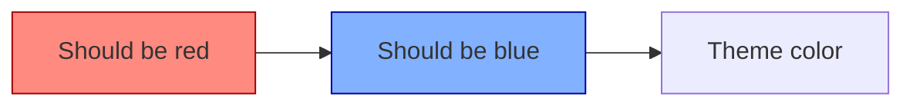

# Mermaid explicit node colors

```mermaid
flowchart LR
    A[Should be red]:::red --> B[Should be blue] --> C[Theme color]
    classDef red fill:#ff8a80,stroke:#a00000
    style B fill:#82b1ff,stroke:#0000a0
```
